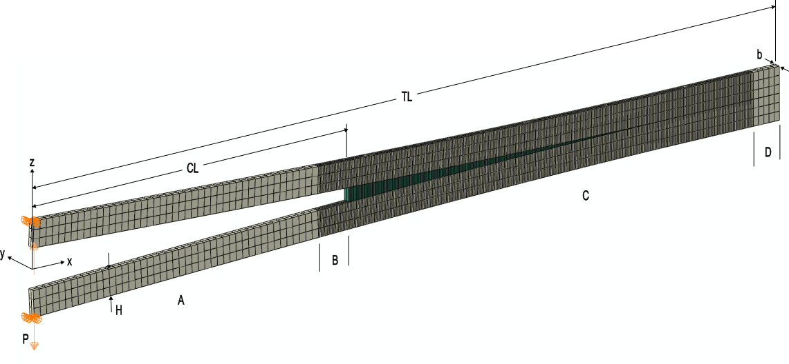

# Interlaminar example problems
<!-- pandoc command:
pandoc readme.md --number-sections -o readmd.pdf
-->

## Doube Cantilever Beam, 3D
This directory contains example models of a double cantilever beam (DCB) specimen, which is one of the most common facture configurations for interlaminar fracture characterization, under which self-similar Mode I crack growth is assumed.
The example models represent a single interface facture using either cohesive elements (COH3D8) or continuum elements (C3D8R).

The load-displacement result can be model analytically using the [modified beam theory (MBT)](https://journals.sagepub.com/doi/10.1243/03093247V244207). These expressions can be evaluated for several $a$ from $a=a_0$ to a relevant final crack length. Note that this formulation is one dimensional and so some small deviation from the 3D results is expected.
$$
P=\sqrt{\frac{G_cbE_{11}I}{(a+\chi H)^2}}
$$
$$
\delta = \frac{2P(a+\chi H)^3}{3E_{11}I}
$$
$$
\chi = \sqrt{\frac{E_{11}}{11G_{13}}\left(3-2\left(\frac{\Gamma}{1+\Gamma}\right)^2\right)}
$$
$$
\Gamma = 1.18\frac{\sqrt{E_{11}E_{22}}}{G_{13}}
$$

## Geometry, mesh, and boundary conditions
The model geometry is illustrated in the figure below, which shows the deformed geometry. The specimen has an overall length `TL` and initial crack length `CL`$=a_0$.
The arms (biege color) have thickness `H` and are assumed to be unidirectional. The width of the model is `WS`$=b$.



The baseline configuration of the model defined in [test_DCB_3D_compdam.inp](./test_DCB_3D_compdam.inp) is as follows (note that some examples include modification of this baseline configuration). The geometry is meshed with `SC8R` elements for the arms and `COH3D8` elements (green color) with zero initial thickness for the fracture interface.
The mesh includes a refined region for the crack propagation and a coarse region for the rest of the model.
Elsets are defined using the labels along the bottom side of the figure A-D. The mesh is matched and shares nodes throughout.
Note, no cohesive elements are included in the initial crack region.

The arms are both displaced, equal and opposite, to minimize the kinetic energy, with prescribed nodal velocity at nodes on the top and bottom arm.
The velocity in $z$ increases with a smooth step amplitude (`*Amplitude, definition=SMOOTH STEP`) during the `ramp_time` to a steady value for the remainder of the `step_time`.
Displacements in $x$ and $y$ are fixed at the load application nodes to prevent rigid body motion without overconstraining the model.
All nodes have $y=0$ prescribed to simulate a plane-strain condition.

### .pes files
Flat input files `*.pes` are generated from the `*.inp` files and `dcb_runner.py` script provided in the same directory as this readme. The `*Parameter` and `*Include` keywords are used extensively along with various substitutions implemented in `dcb_runner.py`. Include files are used for consistency across models and are denoted with file names starting with `_`. For convience, the "flat" input files generated after these substitutions are applied are available in the `pes/` directory. These files are generated by running Abaqus datachecks for each analysis job, and follow Abaqus' convention of being named with the `.pes` file extension. For users unfamiliar with `.pes` files, treat `.pes` as you would a `.inp` file. The following abaverify command can be used to generate or update the `.pes` files.
```
python dcb_runner.py --genPes
```

### Models with quasi static loading
1. [test_DCB_3D_compdam.pes](./pes/test_DCB_3D_compdam.pes): Baseline.
2. [test_DCB_3D_compdam_23.pes](./pes/test_DCB_3D_compdam_23.pes): Propagation along 2-direction instead of 1-direction.
3. [test_DCB_3D_compdam_C3D8R.pes](./pes/test_DCB_3D_compdam_C3D8R.pes): `C3D8R` elements instead of `COH3D8`.
4. [test_DCB_3D_compdam_finite_thk.pes](./pes/test_DCB_3D_compdam_finite_thk.pes): Finite thickness `COHD3D8` elements.
5. [test_DCB_3D_compdam_insert.pes](./pes/test_DCB_3D_compdam_insert.pes): Pre-implanted insert modeled with `COH3D8` elements initialized with damage=1.
6. [test_DCB_3D_compdam_insert_delete.pes](./pes/test_DCB_3D_compdam_insert_delete.pes): Pre-implanted insert modeled with `COH3D8` elements initialized with damage=1, including element deletion.
7. [test_DCB_3D_compdam_multimaterial.pes](./pes/test_DCB_3D_compdam_multimaterial.pes): Large model, having width=20 and the propagation region C subdivided into 4 zones each having a higher fracture toughness than the last. Primary purpose is to evaluate performance of a large model.
8. [test_DCB_3D_compdam_multimaterial_narrow.pes](./pes/test_DCB_3D_compdam_multimaterial_narrow.pes): Identical to the case above, but with width=1 so the model size is much reduced.

### Models with dynamic loading
1. [test_DCB_3D_dyn_coh.pes](./pes/test_DCB_3D_dyn_coh.pes): Baseline, has significant mass in the cohesive elements, influencing the structural response.
2. [test_DCB_3D_dyn_constit_thk.pes](./pes/test_DCB_3D_dyn_constit_thk.pes): Using constitutive thickness so the cohesive elements have negligible mass.
3. [test_DCB_3D_dyn_finite_thk.pes](./pes/test_DCB_3D_dyn_finite_thk.pes): Using finite thickness so that the cohesive elements have negligible mass.
4. [test_DCB_3D_dyn_tie.pes](./pes/test_DCB_3D_dyn_tie.pes): No conhesive elements to provide a reference solution for the dynamic response.

### Models with fatigue loading
1. [test_DCB_3D_fatigue.inp](test_DCB_3D_fatigue.inp): Simple fatigue example.
